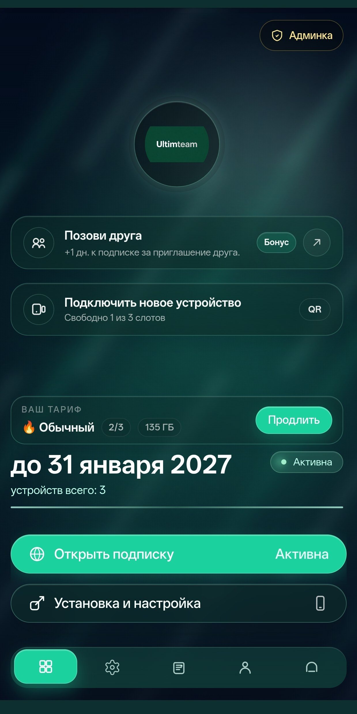

# Remnawave Ultimteam Telegram Bot

Telegram-бот и backend-слой для VPN-сервиса на Remnawave с личным кабинетом PEDZEO.

[](https://www.python.org/)
[](https://www.postgresql.org/)
[](https://redis.io/)
[](LICENSE)

**Кабинет:** [PEDZEO/cabinet-frontend](https://github.com/PEDZEO/cabinet-frontend)

**Бот:** [PEDZEO/remnawave-ultimteam-telegram-bot](https://github.com/PEDZEO/remnawave-ultimteam-telegram-bot)

**Бэкапы панели:** [PEDZEO/remnawave-panel-backup-telegram](https://github.com/PEDZEO/remnawave-panel-backup-telegram)

<p align="center">
  
</p>

---

## Ultim Mode

**Ultim Mode** - режим, где Telegram остается точкой входа и каналом уведомлений, а основные действия пользователя живут в Mini App кабинете.

| Что меняется | Как работает |
| --- | --- |
| Главное меню | Кнопки ведут сразу в нужные разделы кабинета: подписка, баланс, рефералка, устройства, поддержка |
| Старт пользователя | `/start` показывает короткое сообщение и одну кнопку открытия приложения |
| Уведомления | В пользовательских уведомлениях убираются лишние bot-menu callback-кнопки; остаются Mini App действия |
| Привязка аккаунта | Поддерживается привязка через код или provider auth |
| Визуал кабинета | Отдельная Ultima-тема: цвета, пресеты, анимации, логотип |
| Подарки за тапы | Награды за быстрые тапы по логотипу: дни подписки или баланс, дневные лимиты, отчеты админу |

Минимальная связка:

```env
CABINET_ENABLED=true
CABINET_URL=https://cabinet.example.com
CABINET_ALLOWED_ORIGINS=https://cabinet.example.com

MAIN_MENU_MODE=cabinet
MINIAPP_CUSTOM_URL=https://cabinet.example.com
CABINET_ULTIMA_ACCOUNT_LINKING_MODE=code
```

`CABINET_ULTIMA_MODE_ENABLED`, `CABINET_ULTIMA_THEME_CONFIG` и кнопки Ultim-уведомлений настраиваются через кабинет/API и хранятся в системных настройках.

<details>
<summary><strong>Экосистема PEDZEO</strong></summary>

| Компонент | Репозиторий |
| --- | --- |
| Backend и Telegram bot | [PEDZEO/remnawave-ultimteam-telegram-bot](https://github.com/PEDZEO/remnawave-ultimteam-telegram-bot) |
| Личный кабинет | [PEDZEO/cabinet-frontend](https://github.com/PEDZEO/cabinet-frontend) |
| Бэкапы панели Remnawave | [PEDZEO/remnawave-panel-backup-telegram](https://github.com/PEDZEO/remnawave-panel-backup-telegram) |

Автоустановка поддерживает установку backend-бота и кабинета одним сценарием. Точную команду запуска держите в installer-репозитории или внутренней инструкции окружения, чтобы не хранить устаревший `curl | bash` в README продукта.

</details>

<details>
<summary><strong>Функции проекта</strong></summary>

### Пользователь

- покупка, продление и смена тарифов;
- trial, подарочные и бесплатные тарифы;
- управление устройствами через кабинет;
- ссылка/QR для подключения нового устройства;
- докупка трафика с ограниченным сроком действия;
- таймер остатка докупленного трафика;
- реферальная программа с бонусами балансом или днями подписки;
- поддержка через тикеты и/или контакт администратора.

### Админ

- тарифы, периоды, устройства, лимиты трафика и серверы;
- массовое применение лимитов тарифа к активным подпискам;
- опциональное обновление устройств при массовом применении;
- сброс трафика пользователям при обновлении тарифа;
- назначение тарифа пользователю и ручное продление на нужное число дней;
- настройки рефералки в одном разделе;
- ручное прикрепление рефералов к пользователю;
- RBAC, роли и права для админки;
- статистика, платежи, подписки, трафик, пользователи;
- бэкапы, техработы, health-checks.

### Интеграции

- Remnawave API и webhooks;
- Telegram Mini App;
- YooKassa, CryptoBot, Heleket, Tribute, MulenPay, Platega, Freekassa, RioPay, WATA, CloudPayments, Jupiter, Lava и другие платежные провайдеры из `.env.example`;
- PostgreSQL, Redis, Docker Compose.

</details>

<details>
<summary><strong>Быстрый старт</strong></summary>

```bash
git clone https://github.com/PEDZEO/remnawave-ultimteam-telegram-bot.git
cd remnawave-ultimteam-telegram-bot

cp .env.example .env
nano .env

mkdir -p ./logs ./data ./data/backups ./data/referral_qr
chmod -R 755 ./logs ./data

docker compose up -d
docker compose logs -f remnawave_bot
```

Проверка:

```bash
curl http://127.0.0.1:8080/health
```

</details>

<details>
<summary><strong>Основные настройки</strong></summary>

### Бот и Remnawave

```env
BOT_TOKEN=1234567890:token
ADMIN_IDS=123456789

REMNAWAVE_API_URL=https://panel.example.com
REMNAWAVE_API_KEY=remnawave_api_key
```

### Webhook/API

```env
BOT_RUN_MODE=webhook
WEBHOOK_URL=https://bot.example.com
WEBHOOK_PATH=/webhook
WEBHOOK_SECRET_TOKEN=change_me

WEB_API_ENABLED=true
WEB_API_PORT=8080
WEB_API_DEFAULT_TOKEN=change_me
```

### Режим тарифов

```env
SALES_MODE=tariffs
TRAFFIC_SELECTION_MODE=selectable
DEFAULT_DEVICE_LIMIT=3
DEFAULT_TRAFFIC_LIMIT_GB=100
DEFAULT_TRAFFIC_RESET_STRATEGY=MONTH
```

### Подарки за тапы

```env
TAP_REWARDS_ENABLED=false
TAP_REWARDS_THRESHOLD=100
TAP_REWARDS_REWARD_TYPE=subscription_days
TAP_REWARDS_SUBSCRIPTION_DAYS=1
TAP_REWARDS_BALANCE_KOPEKS=5000
TAP_REWARDS_DAILY_REWARD_LIMIT=1
TAP_REWARDS_STREAK_TIMEOUT_SECONDS=1
TAP_REWARDS_ADMIN_NOTIFICATIONS_ENABLED=true
TAP_REWARDS_DAILY_REPORT_ENABLED=true
TAP_REWARDS_DAILY_REPORT_TIME=23:59
```

Полный список параметров: [.env.example](.env.example).

</details>

<details>
<summary><strong>Команды разработки</strong></summary>

```bash
make up
make down
make reload
make reload-follow
make test
```

Локальные проверки:

```bash
uv run pytest
uv run ruff check .
uv run mypy app
```

</details>

<details>
<summary><strong>Структура</strong></summary>

```text
app/
  cabinet/      FastAPI routes для кабинета
  handlers/     Telegram bot handlers
  services/     бизнес-логика
  database/     модели, CRUD, миграции
  webserver/    webhook/API приложение
tests/          автотесты
docs/           дополнительные заметки
```

</details>

---

MIT License. Project by [PEDZEO](https://github.com/PEDZEO).
